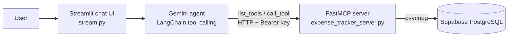

# 💸 Expense Tracker with AI + MCP

A natural-language expense tracker built on the **Model Context Protocol (MCP)**. Type things like *"spent 250 on lunch"* or *"how much did I spend this month?"* and a Gemini-powered agent discovers the available MCP tools at runtime and turns your message into the right database action.

It has two parts:

- **MCP server** (`expense_tracker_server.py`): a remote [FastMCP](https://github.com/jlowin/fastmcp) server that exposes expense tools over HTTP, backed by Supabase PostgreSQL and protected with an API key.
- **Streamlit client** (`stream.py`): a password-gated chat UI with a Gemini tool-calling agent (LangChain) that talks to the server.

<!-- Add a screenshot or demo GIF here, e.g.: -->
<!--  -->

**Live demo:** _add your Streamlit URL here_ (the app is password-protected, so share a demo password or a short video)

---

## Architecture



1. The user sends a message in the Streamlit chat.
2. The agent connects to the MCP server, **discovers its tools at runtime**, and gives their schemas to Gemini.
3. Gemini decides which tool to call (for example `add_expense`) and with what arguments.
4. The server validates the input, runs a parameterized SQL query, and returns the result.
5. The agent replies with a short confirmation. The loop is capped at 4 steps.

---

## Features

- **Natural-language interface:** log, query, edit and delete expenses by chatting.
- **Remote MCP server:** any MCP-compatible client can connect, not just this UI.
- **6 tools + 1 resource** (see below).
- **Secure by default:** API-key auth, parameterized queries, input validation, row-level security enabled.
- **Token-efficient agent:** history windowing, step limits, capped output and trimmed tool schemas.
- **Transparent:** the sidebar can show every tool call the agent made.

## MCP tools

| Tool | What it does |
|---|---|
| `add_expense` | Add an expense (amount, category, description, optional date; defaults to today in your timezone) |
| `list_expenses` | List expenses with optional date range and category filters (max 50 rows) |
| `update_expense` | Update any field of an expense by id |
| `delete_expense` | Delete an expense by id |
| `summarize_expenses` | Total spending plus per-category totals for an optional date range |
| `monthly_report` | Totals and category breakdown for a given year and month |

**Resource:** `expenses://categories` returns the distinct categories used so far.

The server also exposes a `GET /health` endpoint for uptime checks.

## Tech stack

| Layer | Technology |
|---|---|
| MCP server | FastMCP, Python |
| Database | Supabase PostgreSQL (via psycopg, pgbouncer-compatible) |
| Agent | LangChain + Google Gemini (`langchain-google-genai`) |
| Frontend | Streamlit |
| Hosting | Render (server) and Streamlit Cloud (client) |

---

## Getting started

### Prerequisites

- Python 3.10+
- A [Supabase](https://supabase.com) project (for the Postgres connection string)
- A [Google AI Studio](https://aistudio.google.com) API key for Gemini

### 1. Clone and install

```bash
git clone https://github.com/Ruddrayadav/Expense-Tracker-with-ai-mcp-.git
cd Expense-Tracker-with-ai-mcp-
python -m venv .venv
source .venv/bin/activate        # Windows: .venv\Scripts\activate
pip install -r requirements.txt
```

### 2. Configure and run the MCP server

Create a `.env` file:

```env
DATABASE_URL=postgresql://...        # Supabase pooler connection string
MCP_API_KEY=choose-a-long-random-secret
TZ_NAME=Asia/Kolkata                 # optional, used for "today"
```

Start it:

```bash
python expense_tracker_server.py
```

The server creates the `expenses` table on first start and listens on `http://localhost:8000/mcp` (or the `PORT` env var).

### 3. Configure and run the Streamlit client

Add these to your `.env` (or to Streamlit Cloud → App settings → Secrets):

```env
GOOGLE_API_KEY=your-gemini-key
MCP_SERVER_URL=http://localhost:8000/mcp
MCP_API_KEY=same-value-as-the-server
APP_PASSWORD=password-to-open-the-web-app
GEMINI_MODEL=gemini-3.1-flash-lite   # optional
TZ_NAME=Asia/Kolkata                 # optional
```

Start it:

```bash
streamlit run stream.py
```

### Environment variables

| Variable | Used by | Required | Description |
|---|---|---|---|
| `DATABASE_URL` | Server | Yes | Supabase pooler connection string |
| `MCP_API_KEY` | Server and client | Yes | Shared secret sent as a Bearer token |
| `TZ_NAME` | Both | No | Timezone for "today" (default `Asia/Kolkata`) |
| `PORT` | Server | No | Port to listen on (default `8000`; set automatically by Render) |
| `GOOGLE_API_KEY` | Client | Yes | Gemini API key |
| `MCP_SERVER_URL` | Client | Yes | Full URL of the server's `/mcp` endpoint |
| `APP_PASSWORD` | Client | Yes | Password that gates the Streamlit app |
| `GEMINI_MODEL` | Client | No | Gemini model name |

Both apps **fail closed**: they refuse to start if a required secret is missing.

---

## Example prompts

- `Spent 250 on lunch today`
- `Paid 1200 for electricity`
- `How much did I spend this month?`
- `Show my food expenses`
- `Delete the last expense`

All amounts are treated as ₹ (Indian rupees).

---

## Security

- **API-key authentication:** every MCP request must carry a valid Bearer token, checked with a constant-time comparison (`hmac.compare_digest`). The server will not start without `MCP_API_KEY`.
- **SQL injection protection:** all queries use parameterized statements, and inputs are validated (positive amounts, `YYYY-MM-DD` dates, month range 1–12, list limit clamped to 1–50).
- **Row-level security** is enabled on the `expenses` table so Supabase's public REST API can't read or write it. The server connects with its own database role.
- **Password-gated UI:** the Streamlit app holds your API keys, so it requires `APP_PASSWORD` before anything loads.
- **Secrets stay out of git:** keys are read from environment variables or `.env` (listed in `.gitignore`).

## Token and cost controls

The agent is tuned to keep Gemini usage low:

- Only the last **6 messages** are sent as context.
- The agent loop is capped at **4 steps** per request.
- Output is capped at **512 tokens**, with low thinking effort on Gemini 3 models.
- Tool schemas are stripped to the fields Gemini needs, and tool results are truncated to **4,500 characters**.
- The system prompt asks for 1–2 sentence replies.

---

## Project structure

```
.
├── expense_tracker_server.py   # FastMCP server: tools, auth, database layer
├── stream.py                   # Streamlit UI + Gemini tool-calling agent
├── requirements.txt
└── .gitignore
```

## Deployment notes

- **Server:** deploy `expense_tracker_server.py` as a web service (for example on Render) with `DATABASE_URL` and `MCP_API_KEY` set. Point uptime checks at `/health`.
- **Client:** deploy `stream.py` on Streamlit Cloud and set the client secrets above.
- On a free hosting tier the server may sleep when idle, so the first request after a pause can take 30–50 seconds. The client timeout is set to 90 seconds to allow for this.

## Limitations and ideas for improvement

- Single-user: one shared API key and no per-user accounts or data separation.
- No budgets, recurring expenses or charts yet.
- Possible next steps: spending charts, budget alerts, CSV export, multi-user auth, and automated tests for the tools.

## License

_Add a license (for example MIT) if you want others to reuse the code._
